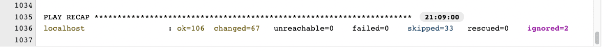

<center> <h1>CP4WatsonAIOps V3.2</h1> </center>
<center> <h2>Demo Environment Installation with AWX</h2> </center>


<center> ©2022 Niklaus Hirt / IBM </center>


<div style="page-break-after: always;"></div>


### ❗ THIS IS WORK IN PROGRESS
Please drop me a note on Slack or by mail nikh@ch.ibm.com if you find glitches or problems.


# Changes

| Date  | Description  | Files  | 
|---|---|---|
|  02.01.2022 | First Draft |  |

<div style="page-break-after: always;"></div>


---------------------------------------------------------------
# Installation
---------------------------------------------------------------

1. [Easy Install](#-1-easy-install)
1. [Provide Entitlement](#2-provide-entitlement)
1. [Installing Components](#3-installing-components)
	1. [Install AI Manager](#31-installing-ai-manager)
	1. [Install Event Manager](#32-installing-event-manager)
	1. [Installing Turbonomic](#33-installing-turbonomic)
	1. [Installing ELK](#34-installing-elk)
	1. [Installing Humio](#35-installing-humio)
	1. [Installing ServiceMest/Istio](#36-installing-servicemesh)
	1. [Installing AWX/AnsibleTower](#37-installing-awx)
	1. [Installing ManageIQ](#38-installing-manageiq
)
1. [AI Manager Configuration](#4-ai-manager-configuration)
1. [Event Manager Configuration](#5-event-manager-configuration)
1. [EventManager Configuration](#11-eventmanager-configuration)
1. [Runbook Configuration](#12-runbook-configuration)

1. [Configure Applications and Topology](#4-configure-applications-and-topology)
1. [Training](#5-training)
1. [Slack integration](#6-slack-integration)
1. [Some Polishing](#7-some-polishing)
1. [Demo the Solution](#8-demo-the-solution)
1. [Troubleshooting](#9-troubleshooting)
1. [Uninstall CP4WAIOPS](#10-uninstall)
1. [EventManager Configuration](#11-eventmanager-configuration)
1. [Runbook Configuration](#12-runbook-configuration)
1. [Installing Turbonomic](#13-installing-turbonomic)
1. [Installing ELK (optional)](#14-installing-ocp-elk)
1. [Installing Humio (optional)](#15-humio)
1. [Installing ServiceMest/Istio (optional)](#16-servicemesh)
1. [Installing AWX/AnsibleTower (optional)](#17-awx)
1. [Detailed Prerequisites](#18-detailed-prerequisites)
1. [Detailed CP4WAIOPS Installation](#19-detailed-cp4waiops-installation)
1. [Additional Configuration](#20-additional-configuration)
1. [Service Now integration](#21-service-now-integration)
1. [Manually train the models](#22-manually-train-the-models)

> ❗You can find a PDF version of this guide here: [PDF](./INSTALL_CP4WAIOPS.pdf).

<div style="page-break-after: always;"></div>


---------------------------------------------------------------
# 🚀 1 Easy Install
---------------------------------------------------------------

## 1.1 Platform Install - AWX


Please create the following two elements in your OCP cluster.


### 1.1.1 Command Line install

You can run run:

```bash
oc apply -n default -f create-installer.yaml

or

kubectl apply -n default -f create-installer.yaml

```


### 1.1.2 Web UI install

Or you can create them through the OCP Web UI:

```yaml
kind: ClusterRoleBinding
apiVersion: rbac.authorization.k8s.io/v1
metadata:
  name: installer-default-default
roleRef:
  apiGroup: rbac.authorization.k8s.io
  kind: ClusterRole
  name: cluster-admin
subjects:
  - kind: ServiceAccount
    name: default
    namespace: default
```

```yaml
apiVersion: apps/v1
kind: Deployment
metadata:
  name: cp4waiops-installer
  namespace: default
  labels:
      app: cp4waiops-installer
spec:
  replicas: 1
  selector:
    matchLabels:
      app: cp4waiops-installer
  template:
    metadata:
      labels:
        app: cp4waiops-installer
    spec:
      containers:
      - image: niklaushirt/cp4waiops-installer:1.3
        imagePullPolicy: Always
        name: installer
        command:
        ports:
        - containerPort: 22
        resources:
          requests:
            cpu: "50m"
            memory: "50Mi"
          limits:
            cpu: "250m"
            memory: "250Mi"
        env:
          - name: INSTALL_REPO
            value : "https://github.com/niklaushirt/awx-waiops.git"
```

---------------------------------------------------------------
## 2 Provide Entitlement
---------------------------------------------------------------

### 2.1 Get the CP4WAIOPS installation token

You can get the installation (pull) token from [https://myibm.ibm.com/products-services/containerlibrary](https://myibm.ibm.com/products-services/containerlibrary).

This allows the CP4WAIOPS images to be pulled from the IBM Container Registry.

<div style="page-break-after: always;"></div>


### 2.2 Enter the CP4WAIOPS installation token

1. Open the AWX instance
2. Select `Inventories`
3. Select `CP4WAIOPS Install`
	
4. Click Edit
5. Replace and uncomment the `ENTITLED_REGISTRY_KEY` 
	
6. Click Save


Yop are now ready to lauch the installations.

---------------------------------------------------------------
## 3 Installing Components
---------------------------------------------------------------

The following Components can be installed:


| Category| Component  | Description  | 
|---|---|---|
| **CP4WAIOPS Base Install** |  |  |  
|| **10_InstallCP4WAIOPSAIManagerwithDemoContent** | Base AI Manager with RobotShop and LDAP integration | 
|| **11_InstallCP4WAIOPSAIEventManager** | Base Event Manager  |  
|| | |  
| **CP4WAIOPS Addons Install** |  | | 
|| 17_InstallCP4WAIOPSToolbox | Debugging Toolbox | 
|| 18_InstallCP4WAIOPSDemoUI | Demo UI to simulate incidents | 
|| | |  
| **Third-party** | | |  
|| 14_InstallRookCeph | |  
|| 20_InstallTurbonomic | | 
|| 21_InstallHumio | | 
|| 22_InstallAWX | | 
|| 22_InstallELK | |  
|| 24_InstallManageIQ | | 
|| 29_InstallServiceMesh | |  
|| | |  
| **Training** |  | |  
|| 85_TrainingCreate | Create all training definitions (LAD, TemporalGrouping, Similar Incidents, Change Risk) | 
|| 86_TrainingLoadLog | Not working yet, please use `./tools/02_training/robotshop-load-logs-for-training.sh` | 
|| 86_TrainingLoadSNOW | Not working yet, please use `./tools/02_training/robotshop-load-snow-for-training.sh` | 
|| 87_TrainingRunLog | Run the LAD Training once the Indexes are loaded | 
|| 87_TrainingRunSNOW | Run the Similar Incidents and Change Risk Training once the Indexes are loaded | 
|| | | 
| **Tools** | | |  
|| 91_DebugPatch | Repatch some errors (non destructive) | 
|| 99_GetCP4WAIOPSLogins | Get Logins for all Components | 
|| optional\_15_InstallLDAP | Already installed by the AI Manager Install | 
|| optional\_16_InstallRobotShop | Already installed by the AI Manager Install | 


## 3.1 Installing AI Manager 


### 3.1.1 Start AI Manager Installation 

1. Log into AWX
2. Click on `Templates`
1. Click on the Rocket 🚀 for entry `10_InstallCP4WAIOPSAIManagerwithDemoContent` to install a base `AI Manager` instance.
2. The Job will start with the installation

	

2. Wait until the Job has finished 

	

### 3.1.2 First Login 

After successful installation, the the URL and the Login Information for your first connections can be found in the Job execution Log.


You can also run `./tools/20_get_logins.sh` at any moment. This will print out all the relevant passwords and credentials (make sure your Terminal is logged into your Cluster).

Usually it's a good idea to store this in a file for later use:

```bash
./tools/20_get_logins.sh > my_credentials.txt
```

<div style="page-break-after: always;"></div>


## 3.1.3 Configure AI Manager 

There are some minimal configurations that you have to do to use the demo system and that are covered by the following flow:

###   🚀 Start here [Create Kubernetes Observer](#4-ai-manager-configuration)

Just click and follow the 🚀 and execute all the steps.

> ### Minimal Configuration
> 
> Those are the minimal configurations you'll need to demo the system and that are covered by the flow above.
> 
> **Configure Topology**
> 
> 1. Create Kubernetes Observer
> 1. Create REST Observer
> 1. Create Topology 🚀
> 1. Create AIOps Application
> 
> **Models Training**
> 
> 1. Train the Models 🚀
> 1. Create Integrations
> 
> **Configure Slack**
> 
> 1. Setup Slack
> 1. Adapt Web Certificates
> 
> **Configure Logins**
> 
> 1. Configure LDAP Logins


<div style="page-break-after: always;"></div>


## 3.2 Installing Event Manager 


### 3.2.1 Start Event Manager Installation 

1. Log into AWX
2. Click on `Templates`
1. Click on the Rocket 🚀 for entry `11_Install CP4WAIOPS AI Event Manager` to install a base `Event Manager` instance.
2. The Job will start with the installation
2. Wait until the Job has finished 


### 3.2.2 First Login 

After successful installation, the the URL and the Login Information for your first connections can be found in the Job execution Log.


You can also run `./tools/20_get_logins.sh` at any moment. This will print out all the relevant passwords and credentials (make sure your Terminal is logged into your Cluster).

Usually it's a good idea to store this in a file for later use:

```bash
./tools/20_get_logins.sh > my_credentials.txt
```

<div style="page-break-after: always;"></div>


### 3.2.3 Configure Event Manager 

There are some minimal configurations that you have to do to use the demo system and that are covered by the following flow:

###   🚀 Start here [Create Kubernetes Observer](#41-create-kubernetes-observer-for-the-demo-applications-)

Just click and follow the 🚀 and execute the steps marked with  .

> ### Minimal Configuration
> 
> Those are the minimal configurations you'll need to demo the system and that are covered by the flow above.
> 
> **Configure Topology**
> 
> 1. Create Kubernetes Observer
> 1. Create REST Observer
> 1. Create Topology (🚀 - Option 51)
> 1. Create AIOps Application
> 
> **Models Training**
> 
> 1. Train the Models (🚀 - Option 55)
> 1. Create Integrations
> 
> **Configure Slack**
> 
> 1. Setup Slack
> 1. Adapt Web Certificates
> 
> **Configure Logins**
> 
> 1. Configure LDAP Logins


<div style="page-break-after: always;"></div>

## 3.3 Installing Turbonomic 

1. Log into AWX
2. Click on `Templates`
1. Click on the Rocket 🚀 for entry `20_Install Turbonomic` to install a base `Turbonomic` instance.
2. The Job will start with the installation
2. Wait until the Job has finished 


## 3.4 Installing ELK 

1. Log into AWX
2. Click on `Templates`
1. Click on the Rocket 🚀 for entry `22_Install ELK` to install a base `ELK` instance.
2. The Job will start with the installation
2. Wait until the Job has finished 


## 3.5 Installing Humio 

1. Log into AWX
2. Click on `Templates`
1. Click on the Rocket 🚀 for entry `21_Install Humio` to install a base `Humio` instance.
2. The Job will start with the installation
2. Wait until the Job has finished 


## 3.6 Installing ServiceMesh 

1. Log into AWX
2. Click on `Templates`
1. Click on the Rocket 🚀 for entry `11_Install CP4WAIOPS AI Event Manager` to install a base `ServiceMesh` instance.
2. The Job will start with the installation
2. Wait until the Job has finished 


## 3.7 Installing AWX 

1. Log into AWX
2. Click on `Templates`
1. Click on the Rocket 🚀 for entry `29_Install ServiceMesh` to install a base `AWX` instance.
2. The Job will start with the installation
2. Wait until the Job has finished 

## 3.8 Installing ManageIQ 

1. Log into AWX
2. Click on `Templates`
1. Click on the Rocket 🚀 for entry `24_Install ManageIQ` to install a base `ManageIQ` instance.
2. The Job will start with the installation
2. Wait until the Job has finished 

---------------------------------------------------------------
# 4 AI Manager Configuration
---------------------------------------------------------------


## 4.1 Configure Applications and Topology

### 4.1.1 Create Kubernetes Observer for the Demo Applications 

Do this for your applications (RobotShop by default)

* In the `AI Manager` "Hamburger" Menu select `Operate`/`Data and tool integrations`
* Click `Add connection`
* Under `Kubernetes`, click on `Add Integration`
* Click `Connect`
* Name it `RobotShop`
* Data Center `demo`
* Click `Next`
* Choose `local` for Connection Type
* Set `Hide pods that have been terminated` to `On`
* Set `Correlate analytics events on the namespace groups created by this job` to `On`
* Set Namespace to `robot-shop`
* Click `Next`
* Click `Done`


### 4.1.2 Create REST Observer to Load Topologies 

* In the `AI Manager` "Hamburger" Menu select `Operate`/`Data and tool integrations`
* Click `Add connection`
* On the left click on `Topology`
* On the top right click on `You can also configure, schedule, and manage other observer jobs` 
* Click on  `Add a new Job`
* Select `REST`/ `Configure`
* Choose “bulk_replace”
* Set Unique ID to “listenJob” (important!)
* Set Provider to whatever you like (usually I set it to “listenJob” as well)
* `Save`


<div style="page-break-after: always;"></div>

### 4.1.3 🚀 Create Topology 

1. Log into AWX
2. Click on `Templates`
1. Click on the Rocket 🚀 for entry `80_Topology Load` to install a base `AI Manager` instance.

❗ Please manually re-run the Kubernetes Observer to make sure that the merge has been done.

### 4.1.4 Create AIOps Application 

#### Robotshop

* In the `AI Manager` go into `Operate` / `Application Management` 
* Click `Define Application`
* Select `robot-shop` namespace
* Click `Next`
* Click `Next`
* Name your Application (RobotShop)
* If you like check `Mark as favorite`
* Click `Define Application`


<div style="page-break-after: always;"></div>

## 4.2 Train the Models

### 4.2.1 🚀 Training 


1. Log into AWX
2. Click on `Templates`
1. Click on the Rocket 🚀 for entry `84_Training All Models` to install a base `AI Manager` instance.
2. This will automatically:
	- Load the training data
	- Create the training definitions
	- Launch the trainings

This will be done for:

- Log Anomaly Detection (Logs)
- Temporal Grouping (Events)
- Similar Incidents (Service Now)
- Change Risk (Service Now)


<div style="page-break-after: always;"></div>

### 4.2.2 Create Integrations 

#### 4.2.2.1 Create Kafka Humio Log Training Integration 

* In the `AI Manager` "Hamburger" Menu select `Define`/`Data and tool integrations`
* Click `Add connection`
* Under `Kafka`, click on `Add Integration`
* Click `Connect`
* Name it `HumioInject`
* Click `Next`
* Select `Data Source` / `Logs`
* Select `Mapping Type` / `Humio`
* Paste the following in `Mapping` (the default is **incorrect**!:

	```json
	{
	"codec": "humio",
	"message_field": "@rawstring",
	"log_entity_types": "kubernetes.namespace_name,kubernetes.container_hash,kubernetes.host,kubernetes.container_name,kubernetes.pod_name",
	"instance_id_field": "kubernetes.container_name",
	"rolling_time": 10,
	"timestamp_field": "@timestamp"
	}
	```
* Click `Next`
* Toggle `Data Flow` to the `ON` position
* Select `Live data for continuous AI training and anomaly detection`
* Click `Save`


<div style="page-break-after: always;"></div>

#### 4.2.2.2 Create Kafka Netcool Training Integration 

* In the `AI Manager` "Hamburger" Menu select `Operate`/`Data and tool integrations`
* Click `Add connection`
* Under `Kafka`, click on `Add Integration`
* Click `Connect`
* Name it `EvetnManager`
* Click `Next`
* Select `Data Source` / `Events`
* Select `Mapping Type` / `NOI`
* Click `Next`
* Toggle `Data Flow` to the `ON` position
* Click `Save`


<div style="page-break-after: always;"></div>


### 4.3 Slack integration


### 4.3.1 Initial Slack Setup 

For the system to work you need to setup your own secure gateway and slack workspace. It is suggested that you do this within the public slack so that you can invite the customer to the experience as well. It also makes it easier for is to release this image to Business partners

You will need to create your own workspace to connect to your instance of CP4WAOps.

Here are the steps to follow:

1. [Create Slack Workspace](./doc/slack/1_slack_workspace.md)
1. [Create Slack App](./doc/slack/2_slack_app_create.md)
1. [Create Slack Channels](./doc/slack/3_slack_channel.md)
1. [Create Slack Integration](./doc/slack/4_slack_integrate.md)
1. [Get the Integration URL - Public Cloud - ROKS](./doc/slack/5_slack_url_public.md) OR 
1. [Get the Integration URL - Private Cloud - Fyre/TEC](./doc/slack/5_slack_url_private.md)
1. [Create Slack App Communications](./doc/slack/6_slack_app_integration.md)
1. [Prepare Slack Reset](./doc/slack/7_slack_reset.md)


<div style="page-break-after: always;"></div>

### 4.3.2 Create valid CP4WAIOPS Certificate 


In order for Slack integration to work, there must be a signed certicate on the NGNIX pods. The default certificate is self-signed and Slack will not accept that. The method for updating the certificate has changed between AIOps v2.1 and V3.1.1. The NGNIX pods in V3.1.1 mount the certificate through a secret called `external-tls-secret` and that takes precedent over the certificates staged under `/user-home/_global_/customer-certs/`.

For customer deployments, it is required for the customer to provide their own signed certificates. An easy workaround for this is to use the Openshift certificate when deploying on ROKS. **Caveat**: The CA signed certificate used by Openshift is automatically cycled by ROKS (I think every 90 days), so you will need to repeat the below once the existing certificate is expired and possibly reconfigure Slack.


This method replaces the existing secret/certificate with the one that OpenShift ingress uses, not altering the NGINX deployment. An important note, these instructions are for configuring the certificate post-install. Best practice is to follow the installation instructions for configuring certificates during that time.

<div style="page-break-after: always;"></div>

### 4.3.2.1 Patch AutomationUIConfig

The custom resource `AutomationUIConfig/iaf-system` controls the certificates and the NGINX pods that use those certificates. Any direct update to the certificates or pods will eventually get overwritten, unless you first reconfigure `iaf-system`. It's a bit tricky post-install as you will have to recreate the `iaf-system` resource quickly after deleting it, or else the installation operator will recreate it. For this reason it's important to run all the commands one after the other. **Ensure that you are in the project for AIOps**, then paste all the code on your command line to replace the `iaf-system` resource.

```bash
NAMESPACE=$(oc project -q)
IAF_STORAGE=$(oc get AutomationUIConfig -n $NAMESPACE -o jsonpath='{ .items[*].spec.storage.class }')
oc get -n $NAMESPACE AutomationUIConfig iaf-system -oyaml > iaf-system-backup.yaml
oc delete -n $NAMESPACE AutomationUIConfig iaf-system
cat <<EOF | oc apply -f -
apiVersion: core.automation.ibm.com/v1beta1
kind: AutomationUIConfig
metadata:
  name: iaf-system
  namespace: $NAMESPACE
spec:
  description: AutomationUIConfig for cp4waiops
  license:
    accept: true
  version: v1.0
  storage:
    class: $IAF_STORAGE
  tls:
    caSecret:
      key: ca.crt
      secretName: external-tls-secret
    certificateSecret:
      secretName: external-tls-secret
EOF
```

<div style="page-break-after: always;"></div>

#### 4.3.2.2 NGNIX Certificate

Again, **ensure that you are in the project for AIOps** and run the following to replace the existing secret with a secret containing the OpenShift ingress certificate.

```bash
WAIOPS_NAMESPACE =$(oc project -q)
# collect certificate from OpenShift ingress
ingress_pod=$(oc get secrets -n openshift-ingress | grep tls | grep -v router-metrics-certs-default | awk '{print $1}')
oc get secret -n openshift-ingress -o 'go-template={{index .data "tls.crt"}}' ${ingress_pod} | base64 -d > cert.crt
oc get secret -n openshift-ingress -o 'go-template={{index .data "tls.key"}}' ${ingress_pod} | base64 -d > cert.key
oc get secret -n $WAIOPS_NAMESPACE iaf-system-automationui-aui-zen-ca -o 'go-template={{index .data "ca.crt"}}'| base64 -d > ca.crt
# backup existing secret
oc get secret -n $WAIOPS_NAMESPACE external-tls-secret -o yaml > external-tls-secret$(date +%Y-%m-%dT%H:%M:%S).yaml
# delete existing secret
oc delete secret -n $WAIOPS_NAMESPACE external-tls-secret
# create new secret
oc create secret generic -n $WAIOPS_NAMESPACE external-tls-secret --from-file=ca.crt=ca.crt --from-file=cert.crt=cert.crt --from-file=cert.key=cert.key --dry-run=client -o yaml | oc apply -f -
#oc create secret generic -n $WAIOPS_NAMESPACE external-tls-secret --from-file=cert.crt=cert.crt --from-file=cert.key=cert.key --dry-run=client -o yaml | oc apply -f -
# scale down nginx
REPLICAS=2
oc scale Deployment/ibm-nginx --replicas=0
# scale up nginx
sleep 3
oc scale Deployment/ibm-nginx --replicas=${REPLICAS}
rm external-tls-secret
```


Wait for the nginx pods to come back up

```bash
oc get pods -l component=ibm-nginx
```

When the integration is running, remove the backup file

```bash
rm ./iaf-system-backup.yaml
```

And then restart the Slack integration Pod

```bash
oc delete pod $(oc get po -n $WAIOPS_NAMESPACE|grep slack|awk '{print$1}') -n $WAIOPS_NAMESPACE --grace-period 0 --force
```

The last few lines scales down the NGINX pods and scales them back up. It takes about 3 minutes for the pods to fully come back up.

Once those pods have come back up, you can verify the certificate is secure by logging in to AIOps. Note that the login page is not part of AIOps, but rather part of Foundational Services. So you will have to login first and then check that the certificate is valid once logged in. If you want to update the certicate for Foundational Services you can find instructions [here](https://www.ibm.com/docs/en/cpfs?topic=operator-replacing-foundational-services-endpoint-certificates).


---------------------------------------------------------------
## 4.4 Some Polishing
---------------------------------------------------------------

### 4.4.1 Add LDAP Logins to CP4WAIOPS 


* Go to `AI Manager` Dashboard
* Click on the top left "Hamburger" menu
* Select `User Management`
* Select `User Groups` Tab
* Click `New User Group`
* Enter demo (or whatever you like)
* Click Next
* Select `LDAP Groups`
* Search for `demo`
* Select `cn=demo,ou=Groups,dc=ibm,dc=com`
* Click Next
* Select Roles (I use Administrator for the demo environment)
* Click Next
* Click Create
* 


---------------------------------------------------------------
# 5 Event Manager Configuration
---------------------------------------------------------------

❗ You only have to do this if you have installed EventManager/NOI (As described in Easy Install - Chapter 6). For basic demoing with AI MAnager this is not needed.


## 5.1 Create Kubernetes Observer for the Demo Applications 

This is basically the same as for AI Manager as we need two separate instances of the Topology Manager. 


* In the `Event Manager` "Hamburger" Menu select `Administration`/`Topology Management`
* Under `Observer jobs` click `Configure`
* Click `Add new job`
* Under `Kubernetes`, click on `Configure`
* Choose `local` for `Connection Type`
* Set `Unique ID` to `robot-shop`
* Set `data_center` to `robot-shop`
* Under `Additional Parameters`
* Set `Terminated pods` to `true`
* Set `Correlate` to `true`
* Set Namespace to `robot-shop`
* Under `Job Schedule`
* Set `Time Interval` to 5 Minutes
* Click `Save`


## 5.2 Create REST Observer to Load Topologies 

* In the `Event Manager` "Hamburger" Menu select `Administration`/`Topology Management`
* Under `Observer jobs` click `Configure`
* Click `Add new job`
* Under `REST`, click on `Configure`
* Choose `bulk_replace` for `Job Type`
* Set `Unique ID` to `listenJob` (important!)
* Set `Provider` to `listenJob` 
* Click `Save`


<div style="page-break-after: always;"></div>

## 5.3 🚀 Create Topology 

1. Log into AWX
2. Click on `Templates`
1. Click on the Rocket 🚀 for entry `81_Topology Load for Event Manager` to install a base `AI Manager` instance.

❗ Please manually re-run the Kubernetes Observer to make sure that the merge has been done.


## 5.4 EventManager Webhook 

Create Webhooks in EventManager for Event injection and incident simulation for the Demo.

The demo scripts (in the `demo` folder) give you the possibility to simulate an outage without relying on the integrations with other systems.

At this time it simulates:

- Git push event
- Log Events (Humio)
- Security Events (Falco)
- Instana Events
- Metric Manager Events (Predictive)
- Turbonomic Events
- CP4MCM Synthetic Selenium Test Events


<div style="page-break-after: always;"></div>


You have to define the following Webhook in EventManager (NOI): 

* `Administration` / `Integration with other Systems`
* `Incoming` / `New Integration`
* `Webhook`
* Name it `Demo Generic`
* Jot down the WebHook URL and copy it to the `NETCOOL_WEBHOOK_GENERIC` in the `./tools/01_demo/incident_robotshop-noi.sh`file
* Click on `Optional event attributes`
* Scroll down and click on the + sign for `URL`
* Click `Confirm Selections`


Use this json:

```json
{
  "timestamp": "1619706828000",
  "severity": "Critical",
  "summary": "Test Event",
  "nodename": "productpage-v1",
  "alertgroup": "robotshop",
  "url": "https://pirsoscom.github.io/grafana-robotshop.html"
}
```

Fill out the following fields and save:

* Severity: `severity`
* Summary: `summary`
* Resource name: `nodename`
* Event type: `alertgroup`
* Url: `url`
* Description: `"URL"`

Optionnally you can also add `Expiry Time` from `Optional event attributes` and set it to a convenient number of seconds (just make sure that you have time to run the demo before they expire.

<div style="page-break-after: always;"></div>

## 5.5 Create custom Filter and View in EventManager 

### 5.5.1 Filter 

Duplicate the `Default` filter and set to global.

* Name: AIOPS
* Logic: **Any** (!)
* Filter:
	* AlertGroup = 'CEACorrelationKeyParent'
	* AlertGroup = 'robot-shop'

#### 11.1.5.2 View 

Duplicate the `Example_IBM_CloudAnalytics` View and set to global.


* Name: AIOPS

Configure to your likings.


## 5.6 Create grouping Policy 

* NetCool Web Gui --> `Insights` / `Scope Based Grouping`
* Click `Create Policy`
* `Action` select fielt `Alert Group`
* Toggle `Enabled` to `On`
* Save

<div style="page-break-after: always;"></div>

## 5.7 Create EventManager/NOI Menu item - Open URL 

in the Netcool WebGUI

* Go to `Administration` / `Tool Configuration`
* Click on `LaunchRunbook`
* Copy it (the middle button with the two sheets)
* Name it `Launch URL`
* Replace the Script Command with the following code

	```javascript
	var urlId = '{$selected_rows.URL}';
	
	if (urlId == '') {
	    alert('This event is not linked to an URL');
	} else {
	    var wnd = window.open(urlId, '_blank');
	}
	```
* Save

Then 

* Go to `Administration` / `Menu Configuration`
* Select `alerts`
* Click on `Modify`
* Move Launch URL to the right column
* Save

<div style="page-break-after: always;"></div>


---------------------------------------------------------------
# 9 ANNEX
---------------------------------------------------------------

## 9.1 Tool Pod Access

```bash
oc exec -it $(oc get po -n default|grep cp4waiops-tools|awk '{print$1}') -n default -- /bin/bash
```